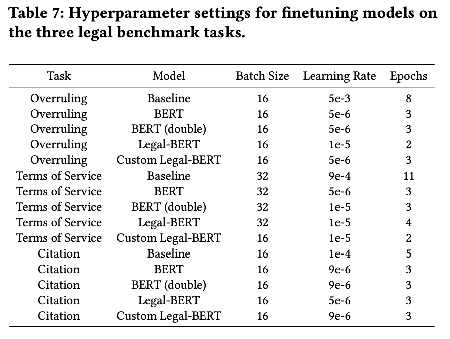
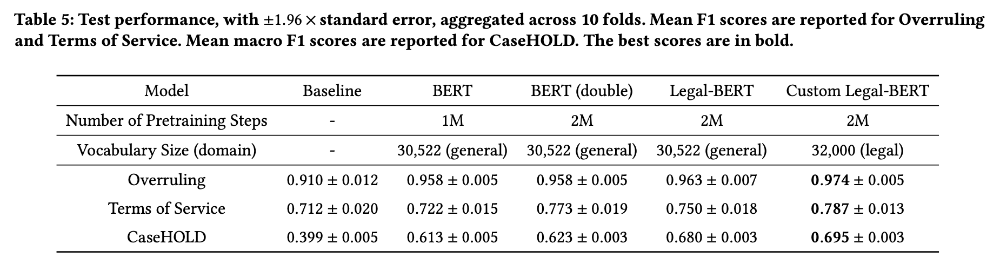

## When Does Pretraining Help? Assessing Self-Supervised Learning for Law and the CaseHOLD Dataset of 53,000+ Legal Holdings

This is the repository for the paper, [When Does Pretraining Help? Assessing Self-Supervised Learning for Law and the CaseHOLD Dataset of 53,000+ Legal Holdings](https://arxiv.org/abs/2104.08671) (Zheng and Guha et al., 2021), accepted to ICAIL 2021.

It includes models, datasets, and code for computing pretrain loss and finetuning Legal-BERT, Custom Legal-BERT, and BERT (double) models on legal benchmark tasks: Overruling, Terms of Service, CaseHOLD.

### Download Models & Datasets
The CaseHOLD dataset and the models can be downloaded directly from Hugging Face: https://huggingface.co/casehold. See `demo.ipynb` for more details on model use.

The legal benchmark task datasets (Overruling, Terms of Service, and CaseHOLD) and the models can also be downloaded from the [casehold Google Drive folder](https://drive.google.com/drive/folders/18YZpKNzbgG3ZWWgmu0Xz6oK3nuv0M2iK?usp=sharing). For more information, see the [Description](https://docs.google.com/document/d/1K3LtZ5Z6Zxh9Xuf5Pu0P4UuPXa_rCuE6b2_gL1yLej8/edit?usp=sharing) document.

### Requirements
This code was tested with Python 3.7 and Pytorch 1.8.1.

Install required packages and dependencies:

    pip install -r requirements.txt

Install transformers from source (required for tokenizers dependencies):

    pip install git+https://github.com/huggingface/transformers

### Model Descriptions
#### Legal-BERT
#####  Training Data
The pretraining corpus was constructed by ingesting the entire [Harvard Law case corpus](https://case.law/) from 1965 to the present. The size of this corpus (37GB) is substantial, representing 3,446,187 legal decisions across all federal and state courts, and is larger than the size of the BookCorpus/Wikipedia corpus originally used to train BERT (15GB). We randomly sample 10% of decisions from this corpus as a holdout set, which we use to create the CaseHOLD dataset. The remaining 90% is used for pretraining. Please see the `case_ids` directory for the case IDs used for pretraining and CaseHOLD task creation. These case IDs are unique identifiers assigned to cases by the Harvard Law case corpus. The mapping of case IDs to cases can be found at: https://case.law/.

##### Training Objective
This model is initialized with the base BERT model (uncased, 110M parameters), [bert-base-uncased](https://huggingface.co/bert-base-uncased), and trained for an additional 1M steps on the MLM and NSP objective, with tokenization and sentence segmentation adapted for legal text (cf. the paper).

#### Custom Legal-BERT 
##### Training Data
Same pretraining corpus as Legal-BERT

##### Training Objective
This model is pretrained from scratch for 2M steps on the MLM and NSP objective, with tokenization and sentence segmentation adapted for legal text (cf. the paper). 

The model also uses a custom domain-specific legal vocabulary. The vocabulary set is constructed using [SentencePiece](https://arxiv.org/abs/1808.06226) on a subsample (approx. 13M) of sentences from our pretraining corpus, with the number of tokens fixed to 32,000.

#### BERT (double)
##### Training Data
BERT (double) is pretrained using the same English Wikipedia corpus that the base BERT model (uncased, 110M parameters), [bert-base-uncased](https://huggingface.co/bert-base-uncased), was pretrained on. For more information on the pretraining corpus, refer to the [BERT: Pre-training of Deep Bidirectional Transformers for Language Understanding](https://arxiv.org/abs/1810.04805) paper.

##### Training Objective
This model is initialized with the base BERT model (uncased, 110M parameters), [bert-base-uncased](https://huggingface.co/bert-base-uncased), and trained for an additional 1M steps on the MLM and NSP objective. 

This facilitates a direct comparison to our BERT-based models for the legal domain, Legal-BERT and Custom Legal-BERT, which are also pretrained for 2M total steps.

### Legal Benchmark Task Descriptions
#### Overruling
We release the Overruling dataset in conjunction with [Casetext](https://casetext.com/), the creators of the dataset.

The Overruling dataset corresponds to the task of determining when a sentence is overruling a prior decision. This is a binary classification task, where positive examples are overruling sentences and negative examples are non-overruling sentences extracted from legal opinions. In law, an overruling sentence is a statement that nullifies a previous case decision as a precedent, by a constitutionally valid statute or a decision by the same or higher ranking court which establishes a different rule on the point of law involved. The Overruling dataset consists of 2,400 examples.

#### Terms of Service
We provide a link to the Terms of Service dataset, created and made publicly accessible by the authors of [CLAUDETTE: an automated detector of potentially unfair clauses in online terms of service](https://arxiv.org/abs/1805.01217) (Lippi et al., 2019).

The Terms of Service dataset corresponds to the task of identifying whether contractual terms are potentially unfair. This is a binary classification task, where positive examples are potentially unfair contractual terms (clauses) from the terms of service in consumer contracts. Article 3 of the [Directive 93/13 on Unfair Terms in Consumer Contracts](https://eur-lex.europa.eu/legal-content/EN/TXT/PDF/?uri=CELEX:31993L0013&from=de) defines an unfair contractual term as follows. A contractual term is unfair if: (1) it has not been individually negotiated; and (2) contrary to the requirement of good faith, it causes a significant imbalance in the parties rights and obligations, to the detriment of the consumer. The Terms of Service dataset consists of 9,414 examples.

#### CaseHOLD
We release the CaseHOLD dataset, created by the authors of our paper, [When Does Pretraining Help? Assessing Self-Supervised Learning for Law and the CaseHOLD Dataset of 53,000+ Legal Holdings](https://arxiv.org/abs/2104.08671) (Zheng and Guha et al., 2021).

The CaseHOLD dataset (Case Holdings On Legal Decisions) provides 53,000+ multiple choice questions with prompts from a judicial decision and multiple potential holdings, one of which is correct, that could be cited. Holdings are central to the common law system. They represent the the governing legal rule when the law is applied to a particular set of facts. It is what is precedential and what litigants can rely on in subsequent cases. The CaseHOLD task derived from the dataset is a multiple choice question answering task, with five candidate holdings (one correct, four incorrect) for each citing context.

For more details on the construction of these legal benchmark task datasets, please see our [paper](https://arxiv.org/abs/2104.08671).

### Hyperparameters for Downstream Tasks
We split each task dataset into a train and test set with an 80/20 split for hyperparameter tuning. For the baseline model, we performed a random search with batch size set to 16 and 32 over learning rates in the bounded domain 1e-5 to 1e-2, training for a maximum of 20 epochs. To set the model hyperparameters for fine-tuning our BERT and Legal-BERT models, we refer to the suggested hyperparameter ranges for batch size, learning rate and number of epochs in [Devlin et al.](https://arxiv.org/abs/1810.04805) as a reference point and perform two rounds of grid search for each task. We performed the coarse round of grid search with batch size set to 16 for Overruling and Terms of Service and batch size set to 128 for Citation, over learning rates: 1e-6, 1e-5, 1e-4, training for a maximum of 4 epochs. From the coarse round, we discovered that the optimal learning rates for the legal benchmark tasks were smaller than the lower end of the range suggested in Devlin et al., so we performed a finer round of grid search over a range that included smaller learning rates. For Overruling and Terms of Service, we performed the finer round of grid search over batch sizes (16, 32) and learning rates (5e-6, 1e-5, 2e-5, 3e-5, 5e-5), training for a maximum of 4 epochs. For CaseHOLD, we performed the finer round of grid search with batch size set to 128 over learning rates (1e-6, 3e-6, 5e-6, 7e-6, 9e-6), training for a maximum of 4 epochs. We report the hyperparameters used for evaluation in the table below.

### Results
The results from the paper for the baseline BiLSTM, base BERT model (uncased, 110M parameters), BERT (double), Legal-BERT, and Custom Legal-BERT, finetuned on the legal benchmark tasks, are displayed below.

### Demo
`demo.ipynb` provides examples of how to run the scripts to compute pretrain loss and finetune Legal-BERT/Custom Legal-BERT models on the legal benchmark tasks. These examples should be able to run on a GPU that has 16GB of RAM using the hyperparameters specified in the examples.

See `demo.ipynb` for details on calculating domain specificity (DS) scores for tasks or task examples by taking the difference in pretrain loss on BERT (double) and Legal-BERT. DS score may be readily extended to estimate domain specificity of tasks in other domains using BERT (double) and existing pretrained models (e.g., [SciBERT](https://arxiv.org/abs/1903.10676)).

### Citation
If you are using this work, please cite it as:

	@inproceedings{zhengguha2021,
		title={When Does Pretraining Help? Assessing Self-Supervised Learning for Law and the CaseHOLD Dataset},
		author={Lucia Zheng and Neel Guha and Brandon R. Anderson and Peter Henderson and Daniel E. Ho},
		year={2021},
		eprint={2104.08671},
		archivePrefix={arXiv},
		primaryClass={cs.CL},
		booktitle={Proceedings of the 18th International Conference on Artificial Intelligence and Law},
		publisher={Association for Computing Machinery}
	}

Lucia Zheng, Neel Guha, Brandon R. Anderson, Peter Henderson, and Daniel E. Ho. 2021. When Does Pretraining Help? Assessing Self-Supervised Learning for Law and the CaseHOLD Dataset. In *Proceedings of the 18th International Conference on Artificial Intelligence and Law (ICAIL '21)*, June 21-25, 2021,  São Paulo, Brazil. ACM Inc., New York, NY, (in press). arXiv: [2104.08671 \[cs.CL\]](https://arxiv.org/abs/2104.08671).

